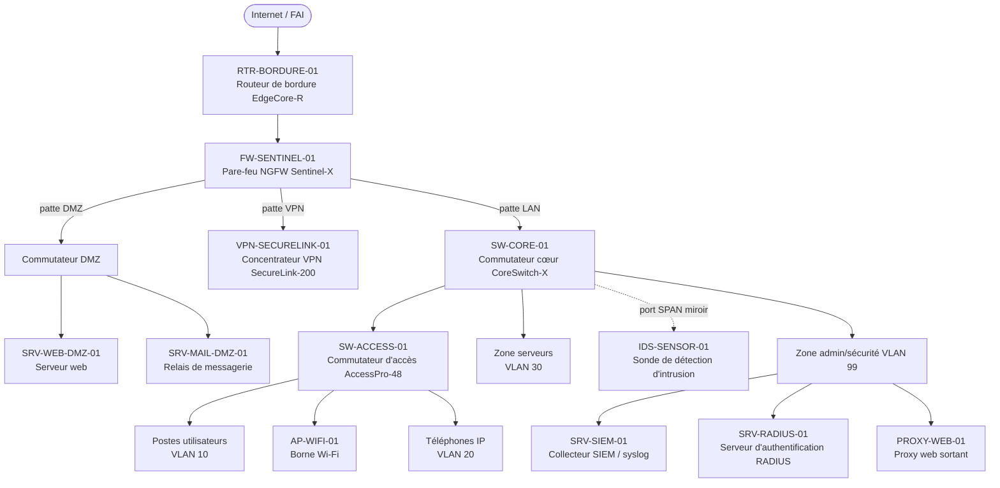

# Architecture réseau de sécurité — Société FICTIVE « Néotech »

> Document de référence interne décrivant la topologie réseau, les équipements de
> sécurité et **les connexions entre eux**. Sert de corpus documentaire pour
> l'assistant IA (agent RAG). Données entièrement fictives.
>
> Version : 1.3 — Dernière mise à jour : avril 2026 — Classification : interne

---

## 1. Vue d'ensemble

Le réseau de Néotech est segmenté en zones de confiance distinctes, séparées par le
pare-feu central. Le principe directeur est la **défense en profondeur** : chaque flux
entre deux zones traverse au moins un point de contrôle, et tous les équipements
envoient leurs journaux vers un collecteur central (SIEM).

Les zones, de la moins fiable à la plus fiable :

1. **Internet** — réseau public, non maîtrisé.
2. **Zone de bordure** — le routeur de bordure, premier point d'entrée.
3. **DMZ** — zone démilitarisée hébergeant les services exposés (web, messagerie, VPN).
4. **LAN utilisateurs** — postes de travail, téléphonie, Wi-Fi.
5. **Zone serveurs** — serveurs applicatifs internes (datacenter).
6. **Zone d'administration et de sécurité** — SIEM, RADIUS, supervision (la plus sensible).

---

## 2. Schéma de la topologie

---

## 3. Plan d'adressage IP

| Zone                       | Sous-réseau        | VLAN | Passerelle      |
|----------------------------|--------------------|------|-----------------|
| Transit FAI (bordure)      | 203.0.113.0/30     | —    | 203.0.113.1     |
| DMZ                        | 192.168.10.0/24    | 40   | 192.168.10.254  |
| LAN utilisateurs           | 10.10.10.0/24      | 10   | 10.10.10.254    |
| Téléphonie (VoIP)          | 10.10.20.0/24      | 20   | 10.10.20.254    |
| Serveurs (datacenter)      | 10.10.30.0/24      | 30   | 10.10.30.254    |
| Administration / Sécurité  | 10.10.99.0/24      | 99   | 10.10.99.254    |

Toutes les passerelles de VLAN internes sont portées par le pare-feu FW-SENTINEL-01
(routage inter-VLAN contrôlé par politique de filtrage).

---

## 4. Plan des VLAN

| VLAN | Nom            | Usage                                   | Porté par                |
|------|----------------|-----------------------------------------|--------------------------|
| 10   | UTILISATEURS   | Postes de travail                       | SW-ACCESS-01, SW-CORE-01 |
| 20   | VOIP           | Téléphones IP (PoE)                      | SW-ACCESS-01             |
| 30   | SERVEURS       | Serveurs applicatifs internes            | SW-CORE-01               |
| 40   | DMZ            | Services exposés (web, mail, VPN)        | Commutateur DMZ          |
| 99   | ADMINISTRATION | SIEM, RADIUS, supervision, proxy         | SW-CORE-01               |

Le VLAN 99 (administration) est isolé : seuls les postes des administrateurs et les
serveurs de sécurité y ont accès. Aucun poste utilisateur standard ne peut l'atteindre.

---

## 5. Inventaire des équipements et de leurs connexions

### 5.1. RTR-BORDURE-01 — Routeur de bordure EdgeCore-R

- **Rôle** : premier point d'entrée depuis Internet ; routage et filtrage de base
  (anti-spoofing, listes de contrôle d'accès en bordure).
- **Placement** : zone de bordure, en amont du pare-feu.
- **Connexions** :
  - Interface `G0/0` → lien FAI (Internet), IP publique 203.0.113.2.
  - Interface `G0/1` → interface WAN du pare-feu FW-SENTINEL-01.
- **Journalisation** : envoie ses journaux en syslog vers SRV-SIEM-01.

### 5.2. FW-SENTINEL-01 — Pare-feu NGFW Sentinel-X

- **Rôle** : point de contrôle central. Filtrage applicatif (couche 7), inspection TLS,
  prévention d'intrusion (IPS), routage inter-VLAN. C'est le cœur de la sécurité réseau.
- **Placement** : en coupure, entre le routeur de bordure et le réseau interne.
- **Interfaces (pattes)** :
  - `WAN` → RTR-BORDURE-01 (vers Internet).
  - `DMZ` → commutateur DMZ (services exposés).
  - `VPN` → concentrateur VPN-SECURELINK-01 (patte dédiée).
  - `LAN` → commutateur cœur SW-CORE-01 (réseau interne).
  - `MGMT` → réseau d'administration (accès admin sur HTTPS 8443).
- **Connexions logiques** : porte les passerelles de tous les VLAN internes ; toute
  communication entre deux zones passe par lui.
- **Journalisation** : exporte en syslog (UDP 514) vers SRV-SIEM-01.

### 5.3. SW-CORE-01 — Commutateur cœur CoreSwitch-X

- **Rôle** : commutateur de cœur de réseau. Agrège les commutateurs d'accès, la zone
  serveurs et la zone d'administration. Achemine le trafic vers le pare-feu.
- **Placement** : datacenter, point central du LAN.
- **Connexions** :
  - Lien montant (uplink) SFP+ → patte `LAN` du pare-feu FW-SENTINEL-01.
  - Lien SFP+ → commutateur d'accès SW-ACCESS-01.
  - Ports cuivre → serveurs de la zone serveurs (VLAN 30).
  - Ports cuivre → serveurs de la zone administration (VLAN 99).
  - **Port SPAN (miroir)** → sonde IDS-SENSOR-01 : recopie tout le trafic pour analyse.
- **Journalisation** : syslog vers SRV-SIEM-01.

### 5.4. SW-ACCESS-01 — Commutateur d'accès AccessPro-48

- **Rôle** : raccordement des équipements terminaux (postes, téléphones, bornes Wi-Fi).
  48 ports gigabit + 4 ports SFP+, PoE+ sur tous les ports cuivre.
- **Placement** : étage utilisateurs.
- **Connexions** :
  - Lien montant SFP+ → commutateur cœur SW-CORE-01.
  - Ports cuivre VLAN 10 → postes de travail.
  - Ports cuivre VLAN 20 (PoE) → téléphones IP.
  - Port cuivre (PoE) → borne Wi-Fi AP-WIFI-01.
- **Sécurité d'accès** : authentification **802.1X** sur les ports utilisateurs ; le
  commutateur interroge le serveur SRV-RADIUS-01 pour autoriser chaque poste.
- **Journalisation** : syslog vers SRV-SIEM-01.

### 5.5. VPN-SECURELINK-01 — Concentrateur VPN SecureLink-200

- **Rôle** : terminaison des accès distants (tunnels IPsec et SSL) pour les
  télétravailleurs. Capacité : 200 tunnels simultanés.
- **Placement** : patte dédiée du pare-feu (exposé de façon contrôlée vers Internet).
- **Connexions** :
  - Côté externe → patte `VPN` du pare-feu FW-SENTINEL-01 (les ports VPN sont ouverts
    en entrée sur le pare-feu : UDP 500, UDP 4500, TCP 443).
  - Côté interne → réseau interne via le pare-feu (accès filtré selon le profil).
- **Authentification** : déléguée à SRV-RADIUS-01 (RADIUS, UDP 1812), MFA recommandée.
- **Journalisation** : syslog vers SRV-SIEM-01.

### 5.6. IDS-SENSOR-01 — Sonde de détection d'intrusion

- **Rôle** : analyse passive du trafic réseau pour détecter les comportements suspects
  (signatures, anomalies). Ne bloque pas (rôle de détection, pas de prévention).
- **Placement** : branchée sur le port miroir (SPAN) du commutateur cœur.
- **Connexions** :
  - Interface de capture → port SPAN de SW-CORE-01 (reçoit une copie du trafic).
  - Interface de gestion → VLAN 99 (administration).
- **Journalisation** : remonte ses alertes vers SRV-SIEM-01.

### 5.7. SRV-RADIUS-01 — Serveur d'authentification RADIUS

- **Rôle** : authentification centralisée des accès. Sert à la fois le 802.1X des
  commutateurs et l'authentification des utilisateurs VPN.
- **Placement** : zone d'administration (VLAN 99).
- **Connexions (clients RADIUS)** :
  - SW-ACCESS-01 (802.1X des postes) → RADIUS sur UDP 1812.
  - VPN-SECURELINK-01 (auth des accès distants) → RADIUS sur UDP 1812.
- **Journalisation** : syslog vers SRV-SIEM-01.

### 5.8. SRV-SIEM-01 — Collecteur SIEM / syslog

- **Rôle** : centralise, corrèle et conserve les journaux de **tous** les équipements.
  Point unique pour la détection et l'investigation (analyse de logs type Splunk).
- **Placement** : zone d'administration (VLAN 99).
- **Connexions (sources de logs)** : reçoit le syslog (UDP 514) de RTR-BORDURE-01,
  FW-SENTINEL-01, SW-CORE-01, SW-ACCESS-01, VPN-SECURELINK-01, IDS-SENSOR-01,
  SRV-RADIUS-01 et PROXY-WEB-01.
- **Rétention** : 90 jours en ligne, archivage froid au-delà.

### 5.9. PROXY-WEB-01 — Proxy web sortant

- **Rôle** : filtre la navigation web sortante des postes internes (filtrage d'URL,
  inspection, journalisation des accès).
- **Placement** : zone d'administration (VLAN 99).
- **Connexions** :
  - Côté interne → reçoit les requêtes web des postes (VLAN 10) sur le port 3128.
  - Côté externe → sort vers Internet **via** le pare-feu FW-SENTINEL-01.
- **Journalisation** : syslog vers SRV-SIEM-01.

---

## 6. Matrice des flux autorisés (qui parle à qui)

| Source                | Destination           | Protocole / Port      | Description                          |
|-----------------------|-----------------------|-----------------------|--------------------------------------|
| Internet              | SRV-WEB-DMZ-01        | TCP 443               | Accès au site web public             |
| Internet              | SRV-MAIL-DMZ-01       | TCP 25                | Réception de messagerie (SMTP)       |
| Internet              | VPN-SECURELINK-01     | UDP 500, 4500 / TCP 443 | Établissement des tunnels VPN      |
| LAN utilisateurs (10) | PROXY-WEB-01          | TCP 3128              | Navigation web (passe par le proxy)  |
| PROXY-WEB-01          | Internet              | TCP 80, 443           | Sortie web filtrée                   |
| LAN utilisateurs (10) | Zone serveurs (30)    | TCP 443, 1433, etc.   | Accès aux applications internes      |
| SW-ACCESS-01          | SRV-RADIUS-01         | UDP 1812              | Authentification 802.1X des postes   |
| VPN-SECURELINK-01     | SRV-RADIUS-01         | UDP 1812              | Authentification des accès distants  |
| Tous les équipements  | SRV-SIEM-01           | UDP 514               | Envoi des journaux (syslog)          |
| Postes admin (99)     | Équipements (MGMT)    | TCP 22, 8443          | Administration (SSH, web)            |

Tout flux non listé est **refusé par défaut** (politique « deny all » du pare-feu).

---

## 7. Chaînes transverses

### 7.1. Chaîne d'authentification

Deux flux d'authentification convergent vers le même serveur RADIUS :

- **Accès filaire** : poste → SW-ACCESS-01 (802.1X) → SRV-RADIUS-01 → autorisation.
- **Accès distant** : télétravailleur → VPN-SECURELINK-01 → SRV-RADIUS-01 (+ MFA) → tunnel établi.

Conséquence sécurité : SRV-RADIUS-01 est un point critique. Sa compromission ou son
indisponibilité affecte à la fois les accès filaires et distants.

### 7.2. Chaîne de journalisation

Tous les équipements émettent leurs journaux en syslog (UDP 514) vers SRV-SIEM-01,
qui les corrèle. C'est le point d'observation central : pour toute investigation,
c'est là que l'on regarde en premier.

### 7.3. Chaîne de détection

Le trafic du cœur de réseau est recopié vers IDS-SENSOR-01 via un port miroir (SPAN).
Les alertes de la sonde remontent au SIEM, où elles sont croisées avec les autres logs.

---

## 8. Notes de segmentation et de sécurité

- Le pare-feu FW-SENTINEL-01 est le **point de passage obligé** entre toutes les zones :
  il n'existe aucun chemin direct contournant le pare-feu entre deux zones de confiance.
- Le **VLAN 99 (administration)** est cloisonné : inaccessible depuis le LAN utilisateurs.
- La **DMZ** ne peut pas initier de connexion vers le LAN interne (flux unidirectionnel
  entrant uniquement) : si un serveur exposé est compromis, il ne peut pas rebondir
  librement vers l'intérieur.
- La sonde **IDS-SENSOR-01** est en écoute passive : elle voit le trafic mais ne peut
  pas le bloquer ; le blocage actif est assuré par l'IPS intégré au pare-feu.
- Points critiques (à protéger en priorité) : FW-SENTINEL-01 (s'il tombe, tout est
  coupé), SRV-RADIUS-01 (authentification) et SRV-SIEM-01 (visibilité).
